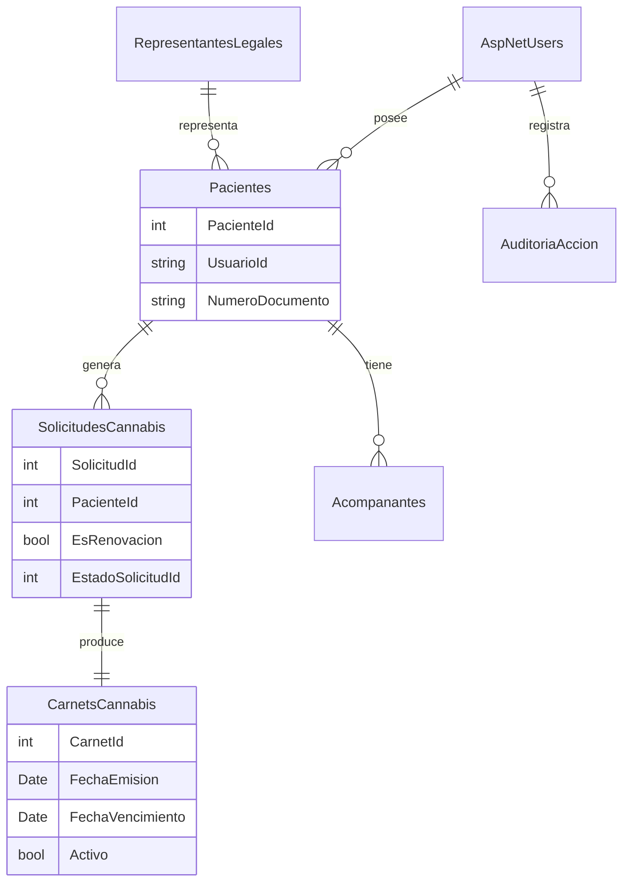

# README.md

## Plataforma DIGESA – Sistema de Certificación para Cannabis Medicinal

---

## 1. Descripción General

La **Plataforma DIGESA para Cannabis Medicinal** es un sistema institucional del Ministerio de Salud de Panamá, desarrollado para gestionar el **proceso de solicitud, evaluación, aprobación y certificación oficial** de pacientes que requieren el uso de cannabis medicinal conforme a prescripción médica válida.

El sistema garantiza:

* Trazabilidad completa del proceso.
* Seguridad de la información.
* Cumplimiento normativo.
* Automatización en la generación de carnets y certificaciones oficiales con código QR.

---

## 2. Objetivo del Sistema

Permitir que:

* Pacientes panameños o extranjeros, o sus representantes legales, envíen solicitudes de certificación.
* Personal médico y administrativo evalúe las solicitudes.
* DIGESA emita carnets oficiales con vigencia definida.
* El sistema notifique estados y vencimientos de forma automática.

---

## 3. Arquitectura Técnica

| Capa          | Tecnología                                  |
| ------------- | ------------------------------------------- |
| Frontend      | Blazor Server (.NET 8 – Interactive Server) |
| Backend       | ASP.NET Core 8                              |
| Autenticación | ASP.NET Core Identity                       |
| Base de Datos | SQL Server                                  |
| ORM           | Entity Framework Core                       |
| Autorización  | Roles y Policies                            |
| PDF           | PDFSharp / QuestPDF                         |
| QR            | QRCoder                                     |
| Logs          | Serilog                                     |
| Validaciones  | FluentValidation                            |

---

## 4. Mapeo Funcional → Tablas SQL Server

### 4.1 Autenticación y Usuarios

**ASP.NET Core Identity (Tablas estándar)**

| Funcionalidad        | Tabla              |
| -------------------- | ------------------ |
| Usuarios del sistema | `AspNetUsers`      |
| Roles                | `AspNetRoles`      |
| Roles por usuario    | `AspNetUserRoles`  |
| Claims               | `AspNetUserClaims` |
| Tokens               | `AspNetUserTokens` |

**Uso en DIGESA**

* Administradores
* Médicos
* Personal administrativo
* Pacientes

---

### 4.2 Pacientes y Representantes

| Entidad lógica                  | Tabla SQL               |
| ------------------------------- | ----------------------- |
| Paciente                        | `Pacientes`             |
| Representante Legal             | `RepresentantesLegales` |
| Relación Paciente–Representante | FK en `Pacientes`       |

**Campos clave**

* `PacienteId`
* `UsuarioId (AspNetUsers)`
* `TipoDocumento`
* `NumeroDocumento`
* `Sexo`
* `FechaNacimiento`
* `Direccion`
* `ProvinciaId`, `CiudadId`, `DistritoId`, `CorregimientoId`

---

### 4.3 Solicitudes de Cannabis Medicinal

| Funcionalidad       | Tabla                                        |
| ------------------- | -------------------------------------------- |
| Solicitud inicial   | `SolicitudesCannabis`                        |
| Renovaciones        | `SolicitudesCannabis` (campo `EsRenovacion`) |
| Estado de solicitud | `EstadoSolicitudId`                          |

**Estados típicos**

* Enviada
* En revisión médica
* En revisión administrativa
* Aprobada
* Rechazada

**Campos clave**

* `SolicitudId`
* `PacienteId`
* `FechaSolicitud`
* `EstadoSolicitudId`
* `Observaciones`
* `MedicoRevisorId`
* `AdministradorRevisorId`

---

### 4.4 Acompañantes

| Funcionalidad            | Tabla          |
| ------------------------ | -------------- |
| Acompañantes autorizados | `Acompanantes` |

**Relación**

* `Acompanantes.PacienteId → Pacientes.PacienteId`

**Uso**

* Solo cuando el paciente lo requiere (menores, discapacidades, etc.).

---

### 4.5 Carnet y Certificación Oficial

| Funcionalidad   | Tabla                              |
| --------------- | ---------------------------------- |
| Carnet generado | `CarnetsCannabis`                  |
| Vigencia        | `FechaEmision`, `FechaVencimiento` |
| Estado          | `Activo`, `Inactivo`, `Vencido`    |

**Reglas**

* Vigencia automática: **2 años**
* Inactivación automática al vencer.

---

### 4.6 Código QR

| Funcionalidad         | Tabla             |
| --------------------- | ----------------- |
| QR asociado al carnet | `CarnetsCannabis` |

**Campos**

* `CodigoQr`
* `HashValidacion`

El QR permite:

* Validación pública.
* Confirmación de vigencia.
* Verificación de autenticidad.

---

### 4.7 Auditoría del Sistema

**Tabla:** `AuditoriaAccion`

| Campo       | Descripción                   |
| ----------- | ----------------------------- |
| `Id`        | Identificador                 |
| `UsuarioId` | Usuario que ejecuta la acción |
| `Accion`    | Acción realizada              |
| `Modulo`    | Módulo afectado               |
| `Fecha`     | Fecha y hora                  |
| `IpOrigen`  | IP                            |
| `UserAgent` | Navegador / dispositivo       |

**Eventos auditados**

* Login / Logout
* Envío de solicitud
* Revisión
* Aprobación / Rechazo
* Generación / inactivación de carnet

---

## 5. Organización del Código

```
/Models
   /Entities        ← Tablas SQL (EF Core)
   /DTOs            ← Transporte de datos
   /ViewModels      ← Blazor
/Repositorios
   /Interfaces
   /Services
/Components
   /Pages
   /Shared
/Templates
   /Emails
/wwwroot
   /qrcodes (temporal)
/Data
   DbContextDigesa.cs
```

---

## 6. Seguridad y Control de Acceso

* Autorización basada en **Roles**.
* Policies para:

    * Revisión médica.
    * Aprobación administrativa.
* Protección de vistas con `<AuthorizeView>`.
* Separación estricta entre usuarios internos y pacientes.

---

## 7. Flujo Operativo del Sistema

1. Paciente envía solicitud.
2. Validación automática inicial.
3. Revisión médica y administrativa.
4. Resultado:

    * **Aprobado:** generación de carnet + PDF + QR + correo.
    * **Rechazado:** notificación con instrucciones presenciales.
5. Control de vigencia y renovaciones.

---

## 8. Pendientes Funcionales

* Listado de usuarios activos / inactivos.
* Listado de pacientes (nuevos vs renovaciones).
* Relevo de responsabilidades administrativas.
* Notificaciones de vencimiento.
* Módulo de reportes y exportación.

---
A continuación tienes la **documentación técnica formal** solicitada, alineada con **tu proyecto real DIGESA**, usando **Entity Framework Core + ASP.NET Identity + SQL Server**, y lista para auditoría, mantenimiento y escalabilidad.

Incluye:

1. **Documentación de cada tabla con su Entity EF Core**
2. **Relaciones y cardinalidades**
3. **Diagrama ER oficial (Mermaid)** listo para README o documentación institucional

---

# Documentación de Base de Datos

## Sistema DIGESA – Cannabis Medicinal

---

## 1. Entidades de Autenticación (ASP.NET Core Identity)

> Estas tablas son estándar y **no deben modificarse estructuralmente**.

### 1.1 AspNetUsers → `ApplicationUser`

```csharp
public class ApplicationUser : IdentityUser
{
    public bool Activo { get; set; }
    public DateTime FechaRegistro { get; set; }
}
```

**Relaciones**

* 1 → N con `Pacientes`
* 1 → N con `AuditoriaAccion`

---

## 2. Pacientes y Representación Legal

### 2.1 Pacientes

```csharp
public class Paciente
{
    public int PacienteId { get; set; }
    public string UsuarioId { get; set; }
    public int TipoDocumento { get; set; }
    public string NumeroDocumento { get; set; }
    public int Sexo { get; set; }
    public DateTime FechaNacimiento { get; set; }

    public int? RepresentanteLegalId { get; set; }

    public ApplicationUser Usuario { get; set; }
    public RepresentanteLegal RepresentanteLegal { get; set; }

    public ICollection<SolicitudCannabis> Solicitudes { get; set; }
    public ICollection<Acompanante> Acompanantes { get; set; }
}
```

**Relaciones**

* `Paciente → AspNetUsers` (N:1)
* `Paciente → SolicitudesCannabis` (1:N)
* `Paciente → Acompanantes` (1:N)

---

### 2.2 RepresentantesLegales

```csharp
public class RepresentanteLegal
{
    public int RepresentanteLegalId { get; set; }
    public string NombreCompleto { get; set; }
    public string Documento { get; set; }
    public string Telefono { get; set; }

    public ICollection<Paciente> Pacientes { get; set; }
}
```

**Relación**

* 1 Representante → N Pacientes

---

## 3. Solicitudes de Cannabis Medicinal

### 3.1 SolicitudesCannabis

```csharp
public class SolicitudCannabis
{
    public int SolicitudId { get; set; }
    public int PacienteId { get; set; }
    public DateTime FechaSolicitud { get; set; }
    public int EstadoSolicitudId { get; set; }
    public bool EsRenovacion { get; set; }
    public string Observaciones { get; set; }

    public string? MedicoRevisorId { get; set; }
    public string? AdministradorRevisorId { get; set; }

    public Paciente Paciente { get; set; }
    public CarnetCannabis Carnet { get; set; }
}
```

**Relaciones**

* `Paciente → SolicitudesCannabis` (1:N)
* `Solicitud → CarnetCannabis` (1:1)

---

## 4. Acompañantes

### 4.1 Acompanantes

```csharp
public class Acompanante
{
    public int AcompananteId { get; set; }
    public int PacienteId { get; set; }
    public string NombreCompleto { get; set; }
    public string Documento { get; set; }

    public Paciente Paciente { get; set; }
}
```

**Relación**

* `Paciente → Acompanantes` (1:N)

---

## 5. Carnet y Certificación Oficial

### 5.1 CarnetsCannabis

```csharp
public class CarnetCannabis
{
    public int CarnetId { get; set; }
    public int SolicitudId { get; set; }
    public DateTime FechaEmision { get; set; }
    public DateTime FechaVencimiento { get; set; }
    public bool Activo { get; set; }

    public string CodigoQr { get; set; }
    public string HashValidacion { get; set; }

    public SolicitudCannabis Solicitud { get; set; }
}
```

**Reglas de Negocio**

* Vigencia fija: **2 años**
* Inactivación automática al vencer

**Relación**

* `Solicitud → CarnetCannabis` (1:1)

---

## 6. Auditoría del Sistema

### 6.1 AuditoriaAccion

```csharp
public class AuditoriaAccion
{
    public int Id { get; set; }
    public string UsuarioId { get; set; }
    public string Accion { get; set; }
    public string Modulo { get; set; }
    public DateTime Fecha { get; set; }
    public string IpOrigen { get; set; }
    public string UserAgent { get; set; }

    public ApplicationUser Usuario { get; set; }
}
```

**Relación**

* `AspNetUsers → AuditoriaAccion` (1:N)

---

## 7. Configuración de Relaciones (DbContext)

```csharp
protected override void OnModelCreating(ModelBuilder modelBuilder)
{
    base.OnModelCreating(modelBuilder);

    modelBuilder.Entity<Paciente>()
        .HasOne(p => p.Usuario)
        .WithMany()
        .HasForeignKey(p => p.UsuarioId);

    modelBuilder.Entity<SolicitudCannabis>()
        .HasOne(s => s.Carnet)
        .WithOne(c => c.Solicitud)
        .HasForeignKey<CarnetCannabis>(c => c.SolicitudId);

    modelBuilder.Entity<Paciente>()
        .HasMany(p => p.Acompanantes)
        .WithOne(a => a.Paciente)
        .HasForeignKey(a => a.PacienteId);
}
```

---

# Diagrama ER Oficial – Sistema DIGESA

Este diagrama puede pegarse **directamente en README.md**, GitHub o documentación institucional.



---


